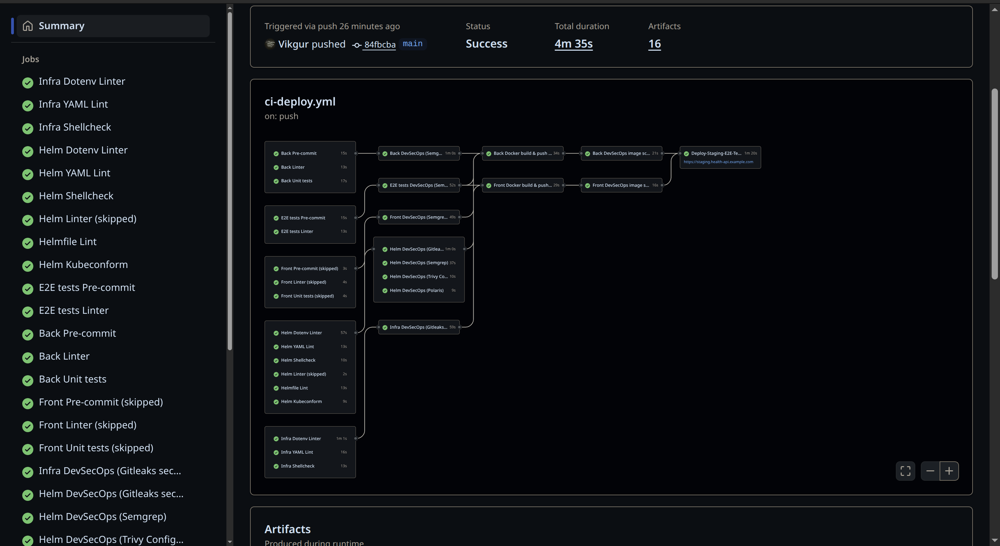

# Оглавление

- [О проекте](#о-проекте)  
  - [Сценарий релизов (Stage → Prod)](#сценарий-релизов-stage--prod)
  - [Разделение по Best Practice](#разделение-по-best-practice)  
  - [Осознанные упрощения](#осознанные-упрощения)  
  - [Успешный прогон](#успешный-прогон)  
  - [Артефакты](#артефакты)  
- [CI/CD структура](#cicd-структура)  
  - [Архитектура](#архитектура)  
    - [.github/workflows/ci-deploy.yml](#githubworkflowsci-deployyml)  
    - [.github/workflows/release-image.yml](#githubworkflowsrelease-imageyml)  
  - [Стадии](#стадии)  
- [DevSecOps практики](#devsecops-практики)  
  - [Локальные проверки (pre-commit)](#локальные-проверки-pre-commit)  
  - [Проверки, встроенные в CI](#проверки-встроенные-в-ci)  
  - [Контейнерная безопасность](#контейнерная-безопасность)  

---

# О проекте

Репозиторий демонстрирует **продвинутую CI/CD-инфраструктуру** для веб-приложения [`health-api`](https://github.com/vikgur/health-api-for-microservice-stack) на базе **GitHub Actions**.  

Реализован единый пайплайн, охватывающий весь жизненный цикл доставки образов для раскатки релизов:

- Сборка контейнеров и анализ уязвимостей  
- E2E-тесты на stage-окружении  
- Подпись и публикация в GHCR  
- Обновление тегов через Argo Image Updater  
- Синхронизация и раскатка релиза в Argo CD  
- [DevSecOps практики](#devsecops-практики) встроены на всех этапах  

В продакшен попадают только **подписанные и проверенные образы**.  

**Раскатка:**  
- На `stage` выполняется полностью автоматически по GitOps-цепочке:  
  **CI → Registry → Cosign → AIU → Argo CD → Rollout**.  
  Stage всегда «на шаг впереди» и тестирует последний релиз.  
- На `prod` раскатка идёт через PR-gate по ручному тегу, с применением стратегии **blue/green + canary** для безопасного переключения трафика и возможности быстрого rollback. 

## Сценарий релизов (Stage → Prod)

1. **Релиз 1**  
   - Выкатился на Stage и Prod → активный цвет `blue`.  

2. **Релиз 2**  
   - Автоматически обновил Stage.  
   - На Prod раскатился как `green` рядом с `blue`.  
   - При canary-переключении выявлен баг → откат на `blue` (`abort/undo`).  
   - Stage остаётся на релизе 2, Prod продолжает работать на релизе 1.  

3. **Релиз 3 (фикс)**  
   - Новый тег → Stage обновился.  
   - На Prod релиз 3 раскатывается как `green` рядом с `blue` (релиз 1).  
   - После успешного теста `promote` → `green` становится активным.  
   - Stage и Prod синхронизированы (оба на релизе 3).  

## Разделение по Best Practice

В целях демонстрации всё объединено в одном CI.  
Однако, в реальных продуктивных системах подобный процесс логически и технически разбивается на отдельные взаимосвязанные пайплайны:

1. **ci-validation-devsecops-gitops-health-api**  
   Предварительная валидация, линтеры, анализ IaC, DevSecOps

2. **ci-images-devsecops-gitops-health-api**  
   Сборка, проверка, публикация Docker-образов

3. **ci-e2e-tests-gitops-health-api**  
   Временное окружение, e2e, smoke, верификация готовности

4. **ci-images-cosign-gitops-health-api**  
   Подпись (cosign), допуск к проду, работа с Argo Image Updater

Такое разделение соответствует best practices GitOps и масштабируемых DevSecOps-платформ, обеспечивая безопасность, независимость и контроль на каждом этапе.

## Осознанные упрощения

- Тяжёлые IaC-практики (OPA/Conftest, Checkov, полноценные policy-as-code) не дублируются и вынесены в профильные репозитории [`Terraform`](https://github.com/vikgur/terraform-yandex-cloud-health-api) / [`Ansible`](https://github.com/vikgur/ansible-gitops-bootstrap-health-api) / [`Helm`](https://github.com/vikgur/helm-blue-green-canary-gitops-health-api).  
- Staging — облегчённое окружение для прогонов в CI e2e-тестов.  

## Успешный прогон

  

## Артефакты

 

---

# CI/CD структура 

## Архитектура 

### .github/workflows/ci-deploy.yml

**Назначение:**  
Основной workflow, задействующий все основные каталоги проекта health-api.

Каталоги:

- `backend/` — API на Python (Flask) + unit-тесты
- `frontend/` — SPA на React + Vite
- `e2e_tests/` — Python (Pytest + Allure)
- `helm/` — Helm-чарты и Helmfile для деплоя в прод (K3s)
- `infra/` — `nginx` и `docker-compose` для всех 18 контейнеров (структурно разделены)
- `mvp_compose/` — `nginx` и `docker-compose` для прода (только 9 MVP-контейнеров)

### .github/workflows/release-image.yml

**Назначение:**  
Релизный workflow для публикации контейнерных образов и PR **в прод**.  
Загружает артефакты с тегами, повторно собирает `backend` и `frontend`, пушит их в GHCR и подписывает через `cosign`.  

При пуше git-тега (например `v1.0.0`) в основной репозиторий:  
1. CI собирает и подписывает образы (`backend`, `frontend`) с тегом `v1.0.0`.  
2. CI автоматически открывает Pull Request в [`gitops-apps-health-api`](https://github.com/vikgur/gitops-apps-health-api).  
   * Под капотом это обычный `git clone` → правка только нужных файлов (`values/*.yaml` и `apps/prod/health-api.yaml`) → новый коммит → PR.  
   * Остальные файлы в `gitops-apps-health-api` остаются без изменений.  
3. В PR:  
   * обновляются `values/*.yaml` с новым тегом `v1.0.0`,  
   * переключается overlay **blue ↔ green**, чтобы новая версия раскатывалась рядом со старой (blue-green + canary).  
4. После merge PR ArgoCD (auto-sync) применяет изменения и раскатывает релиз на **prod**, используя стратегию blue-green с canary-steps.  

## Стадии

1. **CI backend** — тесты, pre-commit, black, сборка, Semgrep, Trivy FS, Trivy image, cosign, image push  
2. **CI frontend** — сборка, Semgrep, Trivy FS, Trivy image, cosign, image push  
3. **E2E tests** — pre-commit, black  
4. **Infra validation** — dotenv-linter, yamllint, shellcheck, gitleaks  
5. **Helm validation** — yamllint, shellcheck, dotenv-linter, gitleaks, kubeconform, helmfile lint, Semgrep, Trivy, Polaris  
6. **Release образов**  
   * **Stage** — образы получают тег `stage-<shortsha>` (уникально для каждого коммита). Argo Image Updater отслеживает новые версии, историю можно сопоставить с SHA.  
   * **Prod** — только по git-тегу `v*`, образы пушатся с фиксированным `:version`.  
7. **Production deploy (ArgoCD)**  
   * **Stage** — auto-sync, каждое обновление `stage-<sha>` автоматически разворачивается.  
   * **Prod** — sync по релизным тегам `v*`; включён ручной gate (e2e-тесты, approve в CI), после чего ArgoCD применяет auto-sync.  

---

# DevSecOps практики

В проект встроен **DevSecOps на каждом этапе** — от локальной разработки до CI/CD пайплайна.  
Каждая строка кода, каждый workflow и каждый контейнер проходят через строгие проверки качества и безопасности.  
Это не дополнение, а часть архитектуры: безопасность встроена по умолчанию, а не «прикручена сверху».  

## Локальные проверки (pre-commit)

- `yamllint` — единый стиль YAML  
- `semgrep` — поиск небезопасных шаблонов в workflow  
- `gitleaks` — защита от утечек секретов  
- `checkov` — политика для GitHub Actions  

## Проверки, встроенные в CI

- `semgrep` — анализ Python/JS (SAST)
- `trivy fs` — проверка зависимостей и Dockerfile (SCA)
- `trivy image` — анализ уязвимостей в образе
- `gitleaks` — проверка на секреты
- `dotenv-linter`, `yamllint`, `shellcheck` — проверка конфигов

## Контейнерная безопасность

- Подпись образов через `Cosign`  
- Проверка подписей в кластере  
- Деплой только trusted-образов из GHCR  

---

> Таким образом, пайплайн гарантирует:  
> чистый код, отсутствие секретов, проверенные workflow и развёртывание только доверенных подписанных артефактов.
