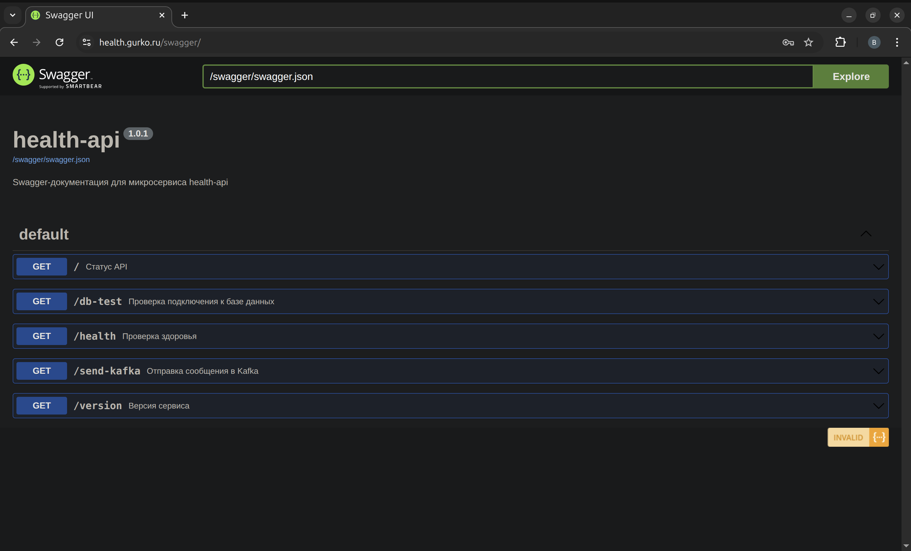

# Оглавление

- [О проекте](#о-проекте)  
  - [Монорепо](#монорепо)
  - [Стек](#стек)  
  - [GitOps](#gitops)  
    - [Инфраструктура](#инфраструктура)  
    - [CI/CD](#cicd)  
    - [Безопасность / DevSecOps](#безопасность--devsecops)  
    - [Веб-приложение](#веб-приложение)  
    - [Observability](#observability)  
  - [Все связанные репозитории](#все-связанные-репозитории)  
- [Связь репозиториев в продакшене](#связь-репозиториев-в-продакшене)  
  - [Цепочка взаимосвязи](#цепочка-взаимосвязи)  
  - [CI/CD](#cicd-1)  
    - [Текущий проект](#текущий-проект)  
    - [Сценарий релизов (Stage → Prod)](#сценарий-релизов-stage--prod)
    - [Продакшен](#продакшен)  
  - [Организация репозиториев в продакшене](#организация-репозиториев-в-продакшене)  
  - [GitOps-поток изменений](#gitops-поток-изменений)  
  - [Управление релизами (Argo Rollouts)](#управление-релизами-argo-rollouts)  
    - [Деплой через PR](#деплой-через-pr)  
    - [Стратегии раскатки](#стратегии-раскатки)  
    - [Управление раскаткой](#управление-раскаткой)  
  - [Rollback](#rollback)  
- [Архитектура](#архитектура)  
  - [MVP в проде](#mvp-в-проде)  
    - [Под капотом](#под-капотом)  
    - [Yandex Cloud структура](#yandex-cloud-структура)  
  - [Локальная архитектура](#локальная-архитектура)  
    - [infra_compose/: Расширенная версия в Docker Compose](#infra_compose-расширенная-версия-в-docker-compose)  
    - [MVP-версия в Minikube](#mvp-версия-в-minikube)  
  - [backend/: Backend-сервис](#backend-backend-сервис)  
  - [frontend/: Frontend-сервис](#frontend-frontend-сервис)  
  - [e2e_tests/: End-to-End тесты](#e2e_tests-end-to-end-тесты)  
  - [Makefile](#makefile)  
  - [.github/: CI/CD структура](#github-cicd-структура)  
    - [Успешный прогон](#успешный-прогон)  
    - [Артефакты](#артефакты)  
  - [ansible/: Ansible-автоматизация](#ansible-ansible-автоматизация)  
  - [helm/: Структура для Dev и Prod](#helm-структура-для-dev-и-prod)  
  - [terraform/: Terraform/Terragrunt-инфраструктура](#terraform-terraformterragrunt-инфраструктура)  
  - [Bash-скрипты](#bash-скрипты)  
- [DevSecOps/Безопасность](#devsecopsбезопасность)  
  - [security_local/config](#security_localconfig)  
  - [security_local/policy](#security_localpolicy)  
  - [.pre-commit-config.yaml](#pre-commit-configyaml)  

---

# О проекте  

Данный репозиторий — **монорепо-портфолио**, демонстрация **end-to-end DevOps/DevSecOps/GitOps-архитектуры** для веб-приложения [`health-api`](https://github.com/vikgur/health-api-for-microservice-stack).  

- **Цепочка поставки в облако:**  
  - Развернута безопасная цепочка поставки с DevSecOps-практиками.  
  - Настроено отдельное stage-окружение, полностью изолированное и идентичное prod (на отдельных ВМ в одном облачном аккаунте).  

- **Локальная отладка:**  
  - [**Расширенная версия**](#infra_compose-расширенная-версия-в-docker-compose) в `docker-compose` (18 контейнеров: backend, frontend, Kafka/Zookeeper, PostgreSQL + PgBouncer, observability, экспортёры) поднимается одной командой через [Makefile](#makefile).  
  - [**MVP-версия**](#mvp-версия-в-minikube) в `Minikube`.  

Весь путь — от создания облака до dev/stage/prod-развёртывания, отладки и управления приложением — **сведён к серии коротких команд в рамках GitOps-потока**.  

Встраивание **продвинутых end-to-end DevSecOps-практик**, охватывающих безопасность всего проекта "под ключ", вынесено в отдельный репозиторий [devsecops-gitops-health-api](#https://github.com/Vikgur/devsecops-gitops-health-api). В текущем репозитории — базовые настройки.

## Монорепо

- **Авторский стенд** продовой микросервисной архитектуры.  
- Полностью рабочий и поднимаемый end-to-end.  
- Все ключевые компоненты собраны в одном месте, папки содержат копии исходных репозиториев с их README.  
- В реальном продакшене используется раздельная структура [GitOps-репозиториев](#все-связанные-репозитории) под управлением Argo CD; здесь — адаптация в формате единого монорепо.  
- Зафиксирован **паттерн GitOps-деплоя**: от IaC и CI/CD до продакшен-развёртывания.  
- Реализована стратегия [**blue-green + canary**](#стратегии-раскатки) для безопасных раскаток и быстрого rollback.  
---

## Стек  

Проект охватывает **полный технологический спектр**, используемый в продакшен-инфраструктуре через GitOps автоматизацию: от IaC и CI/CD до мониторинга и DevSecOps. Ниже перечислены все технологии, сгруппированные по уровням с указанием их роли.  

## GitOps  

- **Argo CD** (Rollouts, Image Updater, Ingress, Cert-manager, External Secrets, Monitoring, Policies)  

### Инфраструктура 

Управление инфраструктурой и контейнерами:  
- **IaC:** Terraform, Terragrunt, Ansible, Bash, Make  
- **Kubernetes:** K3s, K8s (Minikube), Helm, Helmfile
- **Containerization:** Docker  

### CI/CD  

Автоматизация сборки, тестирования и доставки:  
- **Pipeline:** GitHub Actions  
- **Code style & linting:** Black, Isort, Flake8  
- **Unit & integration tests:** Python/Pytest  

### Безопасность / DevSecOps  

Защита цепочки поставки, анализ кода и проверка инфраструктуры.  

**CI:**  
- **Supply chain:** Cosign (подпись и верификация образов)  
- **Secrets & leaks:** Gitleaks  
- **Static analysis (SAST):** Semgrep  
- **Vulnerability scanning (SCA):** Trivy FS, Trivy Image  
- **Policy & compliance:** Polaris, Helmfile lint, Yamllint, Shellcheck, Dotenv-linter, Kubeconform  

**CD:**  
- Проверка `.env`, `docker-compose config`  
- Деплой только trusted-образов из GHCR (подписанных Cosign)  
- Автораскатка stage окружения (клон прода)
- Ручное подтверждение на prod через PR-gate  

**Локально:**  
- **Policy-as-Code:** OPA/Conftest (Terraform, Kubernetes)  
- **Infrastructure scanning:** Checkov, TFLint  
- **Unit-тесты политик:** rego security_test.rego (Kubernetes)  

### Веб-приложение  

Сервисы и компоненты приложения:  
- **Backend:** Python (Flask), Pytest  
- **Frontend:** React, Vite  
- **Тестирование:** Python/Pytest, Allure  
- **Документация:** Swagger UI  
- **Брокеры:** Kafka, Zookeeper, Redpanda Console  
- **БД:** PostgreSQL, PgBouncer  

### Observability  

Контроль, метрики и трассировка:  
- **Monitoring & metrics:** Prometheus, VictoriaMetrics, Alertmanager  
- **Visualization:** Grafana  
- **Tracing:** Jaeger  
- **Экспортёры:** Postgres-exporter, Pgbouncer-exporter, Kafka-exporter  

---

## Все связанные репозитории 

**Infrastructure / DevOps**  
- [terraform-terragrunt-yandex-cloud-health-api](https://github.com/Vikgur/terraform-terragrunt-yandex-cloud-health-api) — создание облачных ресурсов (VPC, VM, k8s-кластер) в Yandex Cloud для Prod и Stage.  
- [ansible-gitops-bootstrap-health-api](https://github.com/vikgur/ansible-gitops-bootstrap-health-api) → установка Argo CD с гибким доступом (SSO через OIDC/Dex или admin с bcrypt).  
- [argocd-config-health-api](https://github.com/vikgur/argocd-config-health-api) → системный конфиг Argo CD (ConfigMap, Repos, Projects, RBAC, Notifications).  
- [gitops-argocd-platform-health-api](https://github.com/vikgur/gitops-argocd-platform-health-api) → базовые платформенные сервисы (argo-rollouts, argocd-image-updater, ingress-nginx, cert-manager, external-secrets, monitoring, policy-engine).  
- [helm-blue-green-canary-gitops-health-api](https://github.com/vikgur/helm-blue-green-canary-gitops-health-api) → «боевые» чарты и values для dev/stage/prod; стратегии деплоя через Argo Rollouts (Blue/Green, Canary).  
- [gitops-apps-health-api](https://github.com/vikgur/gitops-apps-health-api) → конкретные приложения (stage/prod); Application для деплоя backend, frontend и nginx из helm-blue-green-canary-gitops-health-api.  
- [ci-gitops-health-api](https://github.com/vikgur/ci-gitops-health-api) → CI/CD пайплайны: сборка, сканирование и подписание контейнеров, обновление тегов в `gitops-apps-health-api`.  
- [bash-scripts-gitops-health-api](https://github.com/Vikgur/bash-scripts-gitops-health-api) — bash-скрипты для деплоя и автоматизации  
- [k8s-local-minikube-health-api](https://github.com/Vikgur/k8s-local-minikube-health-api) — локальный запуск MVP в Minikube  
- [infra-docker-compose-health-api](https://github.com/Vikgur/prod-ready-dockerized-microservice-stack) — локальная инфраструктура (18 контейнеров)  

**Приложение**  
- [backend-health-api](https://github.com/Vikgur/health-api-for-microservice-stack) — Flask backend  
- [frontend-health-api-ui](https://github.com/Vikgur/health-api-ui-for-microservice-stack) — React/Vite frontend  

**Е2Е-тесты**  
- [e2e-tests-health-api](https://github.com/Vikgur/e2e-tests-health-api-for-microservice-stack) — E2E тесты (Pytest + Allure)  

## Связь репозиториев в продакшене

В реальном продакшене проект разделён на независимые GitOps-репозитории, объединённые через **Argo CD**.

### Цепочка взаимосвязи

**Terraform → Ansible Bootstrap → Argo CD Config → Argo CD Platform → Helm → Argo CD Apps → CI/E2E-тесты → CD → Stage/Prod**.  

Порядок действий и взаимодействие репозиториев:

1. **Подготовка Git-репозиториев**  
   - Локально редактируются и пушатся все конфиги:  
     - [`argocd-config-health-api`](https://github.com/vikgur/argocd-config-health-api)  
     - [`gitops-argocd-platform-health-api`](https://github.com/vikgur/gitops-argocd-platform-health-api)  
     - [`helm-blue-green-canary-gitops-health-api`](https://github.com/vikgur/helm-blue-green-canary-gitops-health-api)  
     - [`gitops-apps-health-api`](https://github.com/vikgur/gitops-apps-health-api)  
   - Репозитории должны быть в Git **до установки Argo CD**, чтобы он смог их подтянуть.  

2. **Создание окружений (stage/prod)**  
   - Из [`terraform-terragrunt-yandex-cloud-health-api`](https://github.com/Vikgur/terraform-terragrunt-yandex-cloud-health-api):  
     создаются сети, ВМ, k3s-кластера в Yandex Cloud.  

3. **Bootstrap (Ansible)**  
   - Из [`ansible-gitops-bootstrap-health-api`](https://github.com/vikgur/ansible-gitops-bootstrap-health-api):  
     установка всех необходимых компонентов, включая Argo CD.  
   - Применяется минимальный bootstrap-`Application`, который указывает на репозиторий [`argocd-config-health-api`](https://github.com/vikgur/argocd-config-health-api).  

4. **Системный конфиг Argo CD**  
   - Argo CD подтягивает манифесты из [`argocd-config-health-api`](https://github.com/vikgur/argocd-config-health-api):  
     Repos, Projects, RBAC, Notifications.  

5. **Платформа (App-of-Apps)**  
   - Argo CD синхронизирует [`gitops-argocd-platform-health-api`](https://github.com/vikgur/gitops-argocd-platform-health-api):  
     image-updater, ingress-nginx, cert-manager, external-secrets, rollouts, monitoring, policies.  

6. **Чарты и values**  
   - Источник в [`helm-blue-green-canary-gitops-health-api`](https://github.com/vikgur/helm-blue-green-canary-gitops-health-api).  
   - Используются приложениями, руками не деплоятся.  

7. **Приложения (stage/prod)**  
   - Argo CD применяет [`gitops-apps-health-api`](https://github.com/vikgur/gitops-apps-health-api):  
     backend, frontend, nginx.  
   - Stage → auto-sync, prune, selfHeal.  
   - Prod → только через PR-gейт.  

8. **CI/CD**  
   - Из [`ci-gitops-health-api`](https://github.com/vikgur/ci-gitops-health-api):  
     сборка, сканирование, подписание образов.  
   - Auto-deploy на stage через Argo Image Updater.  
   - Prod — blue/green/canary только через PR в [`gitops-apps-health-api`](https://github.com/vikgur/gitops-apps-health-api).  

### CI/CD  

#### Текущий проект

в текущем проекте запускается **автоматически в GitHub Actions** из [`ci-gitops-health-api`](https://github.com/vikgur/ci-gitops-health-api). В репозитории должны быть все необходимые каталоги: backend, frontend, e2e_tests, helm, infra_compose (из `ci-gitops-health-api` исключены в целях демонстрации только логики пайплайнов).

Реализовано:
- Сборка, сканирование и подписание контейнеров.  
- Push образов в Registry для E2E-тестов.  
- E2E-тесты: только прошедшие тесты образы тегируются в Registry и раскатываются дальше.  
- Автотегирование и автораскатка на `stage` через Argo Image Updater для приёмочных тестов.  
- Для `prod` — ручное тегирование + Pull Request с обновлением тегов в `gitops-apps-health-api` (PR-gate).  

#### Сценарий релизов (Stage → Prod)

1. **Релиз 1**  
   - Выкатился на Stage и Prod → активный цвет `blue`.  

2. **Релиз 2**  
   - Автоматически обновил Stage.  
   - На Prod раскатился как `green` рядом с `blue`.  
   - При canary-переключении выявлен баг → откат на `blue` (`abort/undo`).  
   - Stage остаётся на релизе 2, Prod продолжает работать на релизе 1.  

3. **Релиз 3 (фикс)**  
   - Новый тег → Stage обновился.  
   - На Prod релиз 3 раскатывается как `green` рядом с `blue` (релиз 1).  
   - После успешного теста `promote` → `green` становится активным.  
   - Stage и Prod синхронизированы (оба на релизе 3).  

**Принцип:** Stage всегда «на шаг впереди», Prod получает только проверенные релизы через blue-green + canary.

#### Продакшен

- **Монолитный пайплайн** (как в текущем проекте) — валидный боевой паттерн: линтеры, DevSecOps, сборка, сканирование, E2E → только проверенные образы уходят в Registry.  
- **Разделение на несколько пайплайнов** (validation, build, e2e, signing) применяется в масштабных продуктивных системах: быстрее фидбэк, параллельность, строгий контроль безопасности.  

В ткущем проекте показан монолит для наглядности, но знание обеих схем важно:  
монолит = практичность, разбиение = best practice для больших платформ.  

---

### Организация репозиториев в продакшене 

В реальном продакшене все репозитории находятся в одной GitHub/GitLab **организации** (например, `company-health-api`).  
Доступы разграничиваются по ролям:  

- **DevOps (полный доступ)**  
  - все инфраструктурные репозитории (`terraform`, `ansible`, `argocd-config`, `gitops-argocd-platform`, `helm-blue-green-canary`, `gitops-apps`, `ci-gitops`)  
  - репозитории приложений (`backend`, `frontend`)  
  - тесты (`e2e-tests`)  
  - утилиты (`bash-scripts`, `k8s-local-minikube`, `infra-docker-compose`)  

- **Backend-разработчики**  
  - `backend-health-api`  

- **Frontend-разработчики**  
  - `frontend-health-api-ui`  

- **AQA (тестировщики)**  
  - `e2e-tests-health-api`  

Таким образом:  
- DevOps имеет доступ ко всему стеку (end-to-end).  
- Разработчики и AQA работают только в своей зоне ответственности.  
- Контроль доступа в организации настраивается через Teams/Groups.  

### GitOps-поток изменений  

- **Инициализация**: в `master` фиксируются стартовые версии конфигураций  
  ([`helm-blue-green-canary-gitops-health-api`](https://github.com/vikgur/helm-blue-green-canary-gitops-health-api),  
  [`gitops-apps-health-api`](https://github.com/vikgur/gitops-apps-health-api),  
  [`argocd-config-health-api`](https://github.com/vikgur/argocd-config-health-api),  
  [`gitops-argocd-platform-health-api`](https://github.com/vikgur/gitops-argocd-platform-health-api),  
  [`terraform-terragrunt-yandex-cloud-health-api`](https://github.com/Vikgur/terraform-terragrunt-yandex-cloud-health-api),  
  [`ansible-gitops-bootstrap-health-api`](https://github.com/vikgur/ansible-gitops-bootstrap-health-api)).  

- **Рабочий процесс**: все изменения выполняются в отдельных ветках, затем вносятся через Pull Request → merge в `master`.  

- **Синхронизация**: Argo CD отслеживает `master` и автоматически приводит кластер к его состоянию.  

- **Fallback**: прямые изменения в кластере допустимы только для отладки, так как вызывают дрейф и будут перезаписаны Argo CD.  

### Управление релизами (Argo Rollouts)

#### Деплой через PR

* Репозиторий [`gitops-apps-health-api`](https://github.com/vikgur/gitops-apps-health-api) используется как точка входа для обновления тегов образов.
* После принятия изменений Argo CD синхронизирует конфигурацию и инициирует раскатку через Argo Rollouts.

#### Стратегии раскатки

* Описываются в [`helm-blue-green-canary-gitops-health-api`](https://github.com/vikgur/helm-blue-green-canary-gitops-health-api) в `values-*.yaml`.
* Поддерживаются Blue/Green и Canary.
* При изменении конфигурации стратегий Argo CD автоматически подхватывает новые значения и применяет их.

#### Управление раскаткой

Процесс контролируется через **Argo Rollouts** (CLI или UI):

```bash
kubectl argo rollouts get rollout <name>      # просмотр статуса - показывает текущее состояние раскатки (версии, трафик, шаги, ревизии)
kubectl argo rollouts promote <name>          # промоутирование - вручную переводит раскатку на следующий шаг или завершает её досрочно
kubectl argo rollouts abort <name>            # остановка или откат - останавливает текущую раскатку и возвращает трафик на предыдущую стабильную версию
kubectl argo rollouts undo <name> --to-revision=<n>  # возврат к ревизии - откатывает приложение к указанной ревизии (n)
```

CLI работает локально через настроенный `kubectl`, взаимодействие происходит с API Kubernetes-кластера.

Для управления раскатками не требуется заходить на ВМ.  

- Устанавливается `kubectl` и плагин `argo-rollouts` локально.  
- Настраивается доступ к кластеру через `kubeconfig`  
  (например, `yc managed-kubernetes cluster get-credentials` или выгрузка с master).  
- Все команды выполняются локально, взаимодействие идёт напрямую с API-сервером кластера.  

### Rollback  

- Поддерживается встроенными возможностями Argo Rollouts через undo.  
- Выполняется как через CLI, так и через UI Argo CD (выбор ревизии).  
- Дополнительно поддерживаются fallback-сценарии через Helmfile и Makefile (описаны в [`helm-blue-green-canary-gitops-health-api`](https://github.com/vikgur/helm-blue-green-canary-gitops-health-api)):  
  - Blue/Green: переключение трафика между слотами (*-blue / *-green).  
  - Canary: остановка rollout на шаге или полный откат версии.  
  - Helmfile-команды позволяют вручную развернуть стабильный образ или восстановить удалённый слот.  
- Важно: при ручном rollback возникает дрейф с Git.  
  - На stage (auto-sync + selfHeal) Argo CD автоматически вернёт кластер к состоянию из Git.  
  - На prod (PR-gate) Argo CD покажет OutOfSync, но изменения не применит без подтверждения.  
- Поэтому в боевом процессе rollback выполняется только через Git (изменение тегов и merge PR), а CLI/Helmfile остаются fallback-инструментами.  

---

# Архитектура

В этом разделе описана структура папок текущего монорепо и приведены ссылки на связанные репозитории проекта, которые отвечают за отдельные части инфраструктуры и приложения.

## MVP в проде  

UI с 4 кнопками, все запросы проходят через `nginx`:  

  

- **Ping API** — проверка доступности API  
- **Health Check** — self-check сервиса  
- **Get Version** — версия backend  
- **DB Test** — подключение к PostgreSQL (insert пользователя)  

Дополнительно:  

- **Swagger:**
  > Эндпоинт Swagger защищён авторизацией через `nginx`: `admin` / `admin`  

  

### Под капотом  

- Монорепозиторий с CI/CD и DevSecOps.  
- Локально — **Minikube**, в проде — кластер **k3s** на 3 VPS в **Yandex Cloud**.  
- Деплой и управление — через **Helm + Helmfile**.  
- Приложение работает в Kubernetes: автоскейлинг, самовосстановление, изоляция, масштабирование.  
- HTTPS через **cert-manager + Let's Encrypt**.  
- Все образы собираются и тегируются в CI/CD, пуш — вручную.  
- Используются встроенные компоненты k3s:  
  - `CoreDNS` — DNS внутри кластера  
  - `local-path-provisioner` — локальное хранилище  
  - `metrics-server` — HPA и мониторинг  
  - `svclb` — балансировка доступа к ingress-контроллеру  

### Yandex Cloud структура


---

## Локальная архитектура  

### infra_compose/: Расширенная версия в Docker Compose  

В `infra_compose/` запускается полный технологический стек проекта (18 контейнеров), включая backend, frontend, брокеры Kafka/Zookeeper, PostgreSQL + PgBouncer, observability (Prometheus, VictoriaMetrics, Grafana, Jaeger, Alertmanager) и экспортёры.  

> Подробное описание сервисов, эндпоинтов и override-конфигураций — в отдельном репозитории [infra-docker-compose-health-api](https://github.com/Vikgur/prod-ready-dockerized-microservice-stack).  

### MVP-версия в Minikube  

Локальный запуск проекта в **Minikube** для отработки DevOps-цикла. Управление через **Helm**, используются готовые (PostgreSQL) и кастомные чарты (backend, frontend, nginx, swagger).  

Cервисы:
- **backend** — Flask API (2 пода).  
- **frontend** — React SPA.  
- **postgres** — база данных.  
- **nginx** — ingress и точка входа.  
- **swagger** — OpenAPI UI.  
- **jaeger** — заглушка для трейсов.  

> Подробности и инструкции — в отдельном репозитории [k8s-local-minikube-health-api](https://github.com/Vikgur/k8s-local-minikube-health-api).  

## backend/: Backend-сервис  

В `backend/` находится API на **Python (Flask)** с базовой бизнес-логикой, health-check эндпоинтами и подключением к PostgreSQL и Kafka. Для unit-тестирования используется **Pytest**, конфигурация обернута в Dockerfile и Helm-чарт.  

> Подробное описание сервиса и его кода — в отдельном репозитории [backend-health-api](https://github.com/Vikgur/health-api-for-microservice-stack).  

## frontend/: Frontend-сервис  

В `frontend/` реализован SPA-интерфейс на **React + Vite**, который взаимодействует с backend через REST API. Проект упакован в Docker-образ, статика отдаётся через Nginx, доступна интеграция со Swagger UI.  

> Подробное описание реализации и сборки фронтенда — в отдельном репозитории [frontend-health-api-ui](https://github.com/Vikgur/health-api-ui-for-microservice-stack).  

## e2e_tests/: End-to-End тесты  

В `e2e_tests/` собраны **E2E тесты** на Python (**Pytest + Allure**) для проверки функциональности приложения в проде и стейдже. Тестируются основные сценарии UI и API, используется отдельный CI workflow.  

> Подробное описание структуры тестов и генерации отчетов — в отдельном репозитории [e2e-tests-health-api](https://github.com/Vikgur/e2e-tests-health-api-for-microservice-stack).  

## Makefile  

Файл сделан минималистично — как пример того, что инфраструктурные задачи можно запускать единообразно через `make`. При необходимости легко расширяется новыми командами (Helm, CI-чеки, деплой и т.п.).   

Текущий Makefile в корне репозитория служит фасадом для локальной работы с инфраструктурой:  

- **infra_compose-up / down** — запуск и остановка полной версии окружения через Docker Compose.  
- **infra_compose-lint** — локальные DevSecOps-проверки для `infra_compose/` (`dotenv-linter`, `yamllint`, `shellcheck`, `gitleaks`).  
- **services-test** — запуск тестов сервисов (плейсхолдер для демонстрации).  
- **docs-sync** — синхронизация документации (плейсхолдер).  

## .github/: CI/CD структура  

Единый CI/CD реализован через **GitHub Actions** для каталогов:  
- `backend/` — API (Flask) + unit-тесты.  
- `frontend/` — SPA (React + Vite).  
- `e2e_tests/` — e2e-тесты (Pytest + Allure).  
- `helm/` — чарты и Helmfile для прод-деплоя.  
- `infra/` — `nginx` и docker-compose для всех 18 контейнеров.  
- `mvp_compose/` — упрощённый прод-стек (9 контейнеров).  

Workflow:  
- `.github/workflows/ci-deploy.yml` — основной CI/CD-процесс.  
- `.github/workflows/release-image.yml` — релиз backend/frontend образов.  

### Успешный прогон

  

### Артефакты

  

> Подробная структура и описание пайплайна — в отдельном репозитории [ci-gitops-health-api](https://github.com/vikgur/ci-gitops-health-api). 

## ansible/: Ansible-автоматизация  

В `ansible/` реализованы роли для установки и настройки **k3s-кластера**, а также деплоя приложения через Helmfile. Окружения разделены на stage и prod, конфигурации хранятся в `inventories/`.  

> Подробное описание ролей, плейбуков и DevSecOps-практик — в отдельном репозитории [ansible-gitops-bootstrap-health-api](https://github.com/vikgur/ansible-gitops-bootstrap-health-api).  

## helm/: Структура для Dev и Prod  

В `helm/` хранится единый набор чартов и values для Dev и Prod, реализованы стратегии деплоя **Blue/Green** и **Canary**. Dev и Prod используют одни и те же чарты, различия задаются только через values.  

> Подробное описание внедренных стратегий деплоя, Kubernetes Best Practices в Helm-чартах и DevSecOps-практик — в отдельном репозитории [helm-blue-green-canary-gitops-health-api](https://github.com/vikgur/helm-blue-green-canary-gitops-health-api).  

## terraform/: Terraform/Terragrunt-инфраструктура  

В `terraform/` описана IaC-инфраструктура в **Yandex Cloud**: сети, ВМ под кластер k3s и сопутствующие ресурсы. Используется backend в Object Storage, переменные вынесены в tfvars.  

> Подробное описание инфраструктуры и DevSecOps-практик — в отдельном репозитории [terraform-terragrunt-yandex-cloud-health-api](https://github.com/Vikgur/terraform-terragrunt-yandex-cloud-health-api).  

## Bash-скрипты  

В проекте используется набор **Bash-скриптов** для автоматизации рутинных шагов: генерация инвентаря Ansible, синхронизация файлов на мастер-ноду, запуск плейбуков и вспомогательные операции при деплое.  

Скрипты оформлены по best practices с минимизацией ручных действий.  

> Подробное описание и полный набор скриптов — в отдельном репозитории [bash-scripts-gitops-health-api](https://github.com/Vikgur/bash-scripts-gitops-health-api).  

---

# DevSecOps/Безопасность

В проект встроен демонстрационный слой **DevSecOps** для паттерна **монорепо**: используются baseline-конфигурации для статического анализа, поиска секретов, сканирования уязвимостей и аудита Kubernetes/ Terraform через Policy-as-Code. Основные настройки собраны в `security_local/config`, а правила в `security_local/policy`.

## security_local/config  

Конфигурации для инструментов **DevSecOps**:  

- **checkov/base.yaml** — baseline для анализа Terraform и Kubernetes.  
- **semgrep/base.yml** — правила статического анализа кода.  
- **gitleaks/base.toml** — поиск секретов и ключей.  
- **polaris/polaris.yaml** — аудит Kubernetes-манифестов на best practices.  
- **trivy/trivy.yaml** — сканирование файловой системы и образов.  
- **yamllint/yamllint.yaml** — проверка YAML (Helm, Ansible, CI) на стиль и ошибки.  

## security_local/policy  

Правила **Policy-as-Code** для проверки инфраструктуры и Kubernetes-манифестов через **OPA/Conftest**:  

- **terraform/security.rego** — проверки Terraform (запрет `0.0.0.0/0`, требование тегов, KMS для storage).  
- **kubernetes/security.rego** — проверки Pod/Deployment/Service (`runAsNonRoot`, запрет privileged, hostNetwork/hostPID/hostIPC, обязательные requests/limits).  
- **kubernetes/security_test.rego** — unit-тесты rego-правил.  

## .pre-commit-config.yaml  

Конфигурация хуков **pre-commit** для автоматических проверок перед коммитом.  
Включает:  

- **Python**: Black, Isort, Flake8  
- **Frontend**: Prettier  
- **Bash**: Shellcheck  
- **YAML**: Yamllint (конфиг `security_local/config/.yamllint.yml`)  
- **Dotenv**: dotenv-linter  
- **Kubernetes/Helm**: Helm lint, Helmfile lint, Kubeconform (`-strict`)  
- **Ansible**: ansible-lint  
- **DevSecOps**:  
  - Gitleaks (конфиг `security_local/config/gitleaks/.gitleaks.toml`)  
  - Semgrep (конфиг `security_local/config/semgrep`)  
- **Generic**: trailing-whitespace, end-of-file-fixer, check-yaml, check-json, check-added-large-files, detect-private-key  

Используется для унификации кода, раннего выявления ошибок и обеспечения качества на локальном этапе разработки.  
