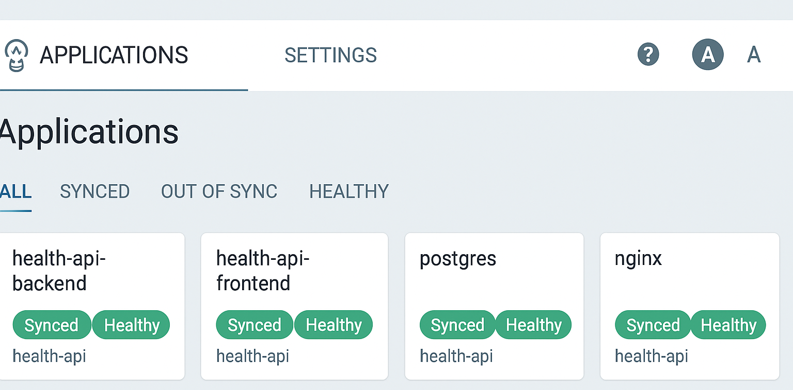

# Оглавление

- [О проекте](#о-проекте)  
  - [Паттерн "закрытый stage/prod"](#паттерн-закрытый-stageprod)  
  - [Доставка образов](#доставка-образов)  
    - [GitOps-сценарий](#gitops-сценарий)  
    - [Fallback/Manual-сценарий](#fallbackmanual-сценарий)  
- [Структура](#структура)  
  - [Основные файлы и директории](#основные-файлы-и-директории)  
  - [Скрипты Ansible](#скрипты-ansible)  
- [Конфигурации окружений](#конфигурации-окружений)  
  - [Структура ansible/](#структура-ansible)  
    - [roles/](#roles)  
      - [Основные (GitOps)](#основные-gitops)  
      - [Вспомогательные (manual / fallback)](#вспомогательные-manual--fallback)  
- [Точка запуска: Makefile](#точка-запуска-makefile)  
  - [Доступные команды](#доступные-команды)  
  - [Типовые сценарии запуска](#типовые-сценарии-запуска)   
- [Инструкция по запуску](#инструкция-по-запуску)  
  - [Логика шагов деплоя](#логика-шагов-деплоя)  
- [Плейбук: шаги выполнения](#плейбук-шаги-выполнения)  
- [Внедренные DevSecOps практики](#внедренные-devsecops-практики)  
  - [Доступ (Аутентификация)](#доступ-аутентификация)  
    - [SSO GitHub OAuth (режим `oidc`)](#sso-github-oauth-режим-oidc)  
    - [SSO Dex (режим `dex`)](#sso-dex-режим-dex)  
    - [Логин/Пароль (режим `login`)](#логинпароль-режим-login)  
    - [Контроль доступа и безопасность](#контроль-доступа-и-безопасность)
  - [RBAC и защита Argo CD](#rbac-и-защита-argo-cd)
  - [Архитектура безопасности](#архитектура-безопасности)  
  - [Покрытие](#покрытие)  
    - [Базовые проверки](#базовые-проверки)  
    - [Линтеры и SAST](#линтеры-и-sast)  
    - [Policy-as-Code](#policy-as-code)  
    - [Конфигурации и безопасность секретов](#конфигурации-и-безопасность-секретов)  
      - [Настройка Ansible Vault](#настройка-ansible-vault)  
    - [CI/CD и инфраструктура](#cicd-и-инфраструктура)  
  - [Результат](#результат)  
  - [Запуск проверок](#запуск-проверок)  
  - [Соответствие OWASP Top-10](#соответствие-owasp-top-10)  

---

# О проекте

Данный проект — рабочее автоматизированное конфигурационное управление для веб-приложения [`health-api`](https://github.com/vikgur/health-api-for-microservice-stack) с использованием **Ansible** и **GitOps на базе Argo CD**.  
Репозиторий выполняет bootstrap k3s-кластера на виртуальных машинах в **Yandex Cloud**, устанавливает системные компоненты (ingress, Argo CD, секреты GHCR) и готовит окружение для дальнейшего управления через GitOps.  

Основные задачи:
* полная автоматизация установки и настройки master/worker-нод;  
* подготовка окружения для Argo CD и GitOps-паттерна;  
* применение конфигурации Projects, RBAC и Git-репозиториев из [`argocd-config-health-api`](https://github.com/vikgur/argocd-config-health-api);  
* применение Argo CD Applications (`stage`, `prod`) из [`gitops-apps-health-api`](https://github.com/vikgur/gitops-apps-health-api) с автоматическим подтягиванием манифестов по переменной окружения;
* настройка доступа к приватному реестру GHCR;  
* установка ingress-контроллера;  
* использование [Makefile](#точка-запуска-makefile) и серии `bash-скриптов` для воспроизводимого запуска шагов;  
* внедрение актуальных [DevSecOps-практик](#внедренные-devsecops-практики) с оптимальным покрытием;  
* организация доставки образов по [GitOps-сценарию](#gitops-сценарий).



## Паттерн "закрытый stage/prod"

**В проекте реализован паттерн `stage/prod` с закрытыми воркерами и управлением через GitOps:**  

- Мастер-нода имеет публичный доступ, воркеры изолированы от внешнего мира.  
- Bootstrap Ansible выполняет только первичную настройку (установка k3s, ingress, Argo CD, GHCR-секретов).  
- После этого управление полностью передаётся Argo CD: деплой сервисов, стратегии раскатки (blue/green, canary) и контроль изменений.  
- Разделение на `stage` и `prod` гарантирует идентичность окружений: все изменения проходят тестирование на стейдже и только затем промоутятся в прод.  

Такой паттерн применяется в боевых системах: безопасность, контроль drift-конфигураций и воспроизводимость обеспечиваются GitOps-подходом в связке с Argo CD.  

## Доставка образов

### GitOps-сценарий

Роли и плейбук проекта соответствуют основному GitOps-сценарию:

* Агенты остаются закрытыми, но имеют outbound-доступ (через NAT Yandex Cloud).
* Образы тянутся напрямую из GHCR по HTTPS.
* Доступ обеспечивается через `imagePullSecrets` (`ghcr-secret`).
* Роли `images_*` не используются (оставлены только как fallback).

### Fallback/Manual-сценарий

Проект включает в себя базовые роли для Fallback/Manual-сценария:

* Агенты полностью закрытые, без публичных IP и без доступа в интернет.
* Образы могут собираться локально через роли `images_*` и загружаться по `.tar` на ноды.
* Поддержка полностью изолированного контура.

> Подробное описание ролей и плейбуков для Fallback/Manual-сценария — в отдельном репозитории [ansible-manual-health-api](https://github.com/Vikgur/ansible-manual-health-api).

---

# Структура

## Основные файлы и директории

* **ansible/** — Boilerplate для воспроизводимой установки/обновления кластера и деплоя приложения в двух средах (stage/prod).  
* **.ansible-lint** — конфигурация ansible-lint: профиль production, исключения, строгие правила.  
* **.gitignore** — исключает артефакты (vault ключи, логи, tmp-файлы) из Git.  
* **.gitleaks.toml** — правила gitleaks: поиск секретов, игнор зашифрованных файлов и артефактов.  
* **.pre-commit-config.yaml** — хуки для автоматических проверок (ansible-lint, yamllint, shellcheck, gitleaks).  
* **.yamllint.yml** — правила для yamllint (стиль и валидация YAML).  
* **Makefile** — единая точка запуска: линтеры, DevSecOps-проверки, ansible-playbook, bash-скрипты.  
* **README.md** — документация по проекту: структура, инструкции запуска, DevSecOps практики.  

## Скрипты Ansible

* **add_ips_to_hosts.sh** — собирает IP-адреса нод и формирует `ansible/inventories/<env>/hosts.yaml`.
* **sync_to_master.sh** — синхронизирует каталоги (`ansible/`, `helm/`, `charts/`) на мастер-ноду.
* **run_ansible_on_master.sh** — запускает Ansible-плейбук уже с мастер-ноды (используется в целях `make deploy`, `make bootstrap-argocd`) и включает применение конфигурации Argo CD (Projects, RBAC, Git-репозитории) из склонированных GitOps-репозиториев.

---

# Конфигурации окружений

* **ansible/group_vars/prod** — переменные прода: доступ к GHCR, теги образов, параметры деплоя.  
* **ansible/group_vars/stage** — точная копия прода для тестов в идентичном окружении.  
* **ansible/group_vars/vault** — зашифрованные секреты Ansible Vault (токены/пароли и т.п.).  
* **ansible/inventories/prod** — инвентарь прод-кластера (master/workers, коннекты).  
* **ansible/inventories/stage** — инвентарь стейджа.  

## Структура ansible/

Всё, что специфично для окружения, вынесено в group_vars и inventories. Секреты — через Ansible Vault.

* `group_vars/` — переменные по окружениям и общие.  
  * `prod/`  
    * `ghcr.yaml` — параметры реестра/секрета, namespace, политика pull.  
    * `version.yaml` — версия/тег образов и релиза для прод-деплоя.  
  * `stage/`  
    * `ghcr.yaml` — аналогично prod, но для стейджа.  
    * `version.yaml` — тег/версия для стейджа.  
  * `vault/`  
    * `vault.yaml` — зашифрованные секреты (напр., GHCR_TOKEN и т.д.).  
  * `master.yaml` — общие переменные мастера (пути/настройки, не зависящие от окружения).  
* `inventories/`  
  * `prod/hosts.yaml` — список хостов и соединений для прода.  
  * `stage/hosts.yaml` — список хостов и соединений для стейджа.  
* `roles/` — роли с идемпотентной логикой.  
* **.vault_pass.txt** — файл с паролем для Ansible Vault, чтобы расшифровывать секреты автоматически.  
* **ansible.cfg** — глобальная конфигурация Ansible (пути к ролям, inventory, настройки ssh, retries).  
* **playbook.yaml** — основной плейбук: вызов ролей (k3s, docker, deploy и др.) для установки и деплоя.  
* **requirements.yml** — список внешних ролей/коллекций Ansible, которые нужно подтянуть через `ansible-galaxy`.  

### roles/

#### Основные (GitOps):
   * **argocd** — установка и bootstrap Argo CD в кластер. 
   * **argocd-apps** — применение Argo CD Applications (`stage`, `prod`) из заранее клонированного репозитория `gitops-apps-health-api`. 
   * **argocd-config** — настройка Projects, RBAC, Git-репозиториев и параметров контроллера Argo CD из клонированного репо argocd-config-health-api.
   * **common** — базовые настройки окружения (пакеты, ssh, системные утилиты).
   * **docker** — установка и настройка docker/ctr утилит, нужных для работы с образами.  
   * **ghcr** — настройка доступа к GitHub Container Registry (секреты, логин).  
   * **ingress** — настройка ingress-nginx контроллера и зависимостей.  
   * **k3s** — установка и настройка сервера/агентов k3s, базовые проверки.  
   * **kubernetes-tools** — утилиты для работы с кластером (kubectl, helm, helmfile и др.).  

**roles/argocd/templates:**

* **argocd-cm.yaml.j2** — базовый ConfigMap Argo CD (отключает анонимов, включает статус-бейджи, выключает exec).
* **argocd-rbac-cm.yaml.j2** — RBAC-политики: доступ admin, политика по умолчанию readonly.
* **ingress.yaml.j2** — Ingress без TLS (http), используется для быстрого bootstrap или когда cert-manager ещё не готов.
* **ingress-tls.yaml.j2** — Ingress с TLS (https), используется вместе с cert-manager и ClusterIssuer.

#### Вспомогательные (manual / fallback):**
   * **deploy** — деплой приложения через helm/helmfile с использованием VERSION.  
   * **distribute_tar_images** — распространение .tar-образов на ноды.  
   * **images_copy_to_agents** — копирование подготовленных образов с мастера на воркеры.  
   * **images_master** — подготовка и экспорт образов на мастере.  
   * **import_images_on_agents** — импорт ранее скопированных образов на воркерах.  
   * **nginx_fix** — фикс багов/патчей для nginx после установки.  

---

# Точка запуска: Makefile

В проекте используется `Makefile` как единая точка запуска. Все основные действия — линтеры, подготовка инвентаря, синхронизация и деплой — запускаются через `make`.

## Доступные команды

* `make help` — список доступных целей.
* `make lint ENV=stage` — прогоняет DevSecOps проверки (`ansible-lint`, `yamllint`, `shellcheck`).
* `make add-ips ENV=stage` — получает IP из Yandex Cloud и обновляет `ansible/inventories/stage/hosts.yaml`.
* `make sync ENV=stage` — синхронизирует директорию `ansible/` и вспомогательные файлы на мастер-ноду.
* `make deploy ENV=stage` — подключается к мастеру и запускает `ansible-playbook` для установки и деплоя.
* `make all ENV=stage` — выполняет все шаги деплоя: `lint → add-ips → sync → deploy`.
* `make bootstrap-argocd ENV=stage` — одноразовый bootstrap Argo CD (выполняется только роль `argocd`).  

## Типовые сценарии запуска

* **Первый запуск** (bootstrap Argo CD на stage):

  ```bash
  make lint ENV=stage
  make all  ENV=stage
  make bootstrap-argocd ENV=stage
  ```

* **Повторный запуск** (любой env):

  ```bash
  make lint ENV=<stage|prod>
  make all  ENV=<stage|prod>
  ```

* **Пошагово** (пример для prod):

  ```bash
  make add-ips ENV=prod && \
  make sync    ENV=prod && \
  make deploy  ENV=prod
  ```

> Без `ENV` цели не выполняются (защита от случайного деплоя).

---

# Инструкция по запуску

1. Установить локальные зависимости: `ansible`, `ansible-lint`, `yamllint`, `shellcheck`, `pre-commit`, `gitleaks`.

   > Argo CD и остальные компоненты устанавливаются плейбуком, вручную их ставить не нужно.
2. [Настроить Ansible Vault](#настройка-ansible-vault) (`.vault_pass.txt` с паролем).
3. Добавить ssh-ключи в облако (Terraform это уже сделал).
4. Выполнить деплой на stage:

   ```bash
   make all ENV=stage
   ```
5. (одноразово) выполнить bootstrap Argo CD:

   ```bash
   make bootstrap-argocd ENV=stage
   ```
6. После проверки — деплой в prod:

   ```bash
   make all ENV=prod
   ```

## Логика шагов деплоя

1. **lint** — проверка кода и конфигов.
2. **add-ips** — подтягиваются IP ВМ и формируется inventory.
3. **sync** — синхронизация ansible/ и зависимостей на мастер.
4. **deploy** — запуск плейбука (k3s, ingress, Argo CD, GHCR-секреты).

---

## Плейбук: шаги выполнения

1. **Базовая подготовка** — установка утилит, пакетов и Python-модуля для Kubernetes.
2. **Агенты** — разворачивание worker-нод k3s и подключение их к мастеру.
3. **Namespace** — создание пространства `health-api` для приложений.
4. **Инструменты** — установка Helm, Helmfile и плагинов на мастер.
5. **Docker** — установка Docker при необходимости (вспомогательные задачи).
6. **Ingress** — разворачивание ingress-nginx для внешнего трафика.
7. **Argo CD** — установка Argo CD в namespace `argocd`.
8. **GHCR секреты** — создание `ghcr-secret` в `argocd` и `health-api` для доступа к приватным образам.
9. **Проверки** — проверка, что все ноды находятся в статусе Ready.
10. **Argo CD Config** — применение конфигурации Argo CD (Projects, RBAC, Repos) из `argocd-config-health-api`.
11. **Argo CD Applications** — применение `Application`-манифестов (`stage`, `prod`) из репозитория `gitops-apps-health-api` с помощью роли `argocd-apps`.
12. **NodePort (опционально)** — патчинг ingress-сервиса в режим `NodePort` для доступа без внешнего ingress-контроллера.

---

# Внедренные DevSecOps практики

Подход к организации проекта изначально выстроен вокруг безопасного паттерна `stage/prod` с закрытыми портами воркеров; DevSecOps-практики встроены в него как обязательный слой контроля и автоматических проверок.

Для работы проверок должны быть установлены: **ansible-lint**, **yamllint**, **shellcheck**, **pre-commit**, **gitleaks**.

## Доступ (аутентификация)

Проект поддерживает три режима аутентификации в Argo CD:

* `oidc` — прямое подключение к GitHub OAuth (основной)
* `dex` — через OIDC-прокси Dex
* `login` — базовый логин/пароль через bcrypt

### SSO GitHub OAuth (режим `oidc`)

В продовой конфигурации активен SSO через GitHub:

* Прямое подключение через `oidc.config`
* Используются группы `g:devops`, `g:qa` из GitHub-организации
* Настройки безопасности (RBAC, AppProjects) работают в связке с группами

UI Argo CD показывает кнопку "Login with GitHub".

### SSO Dex (режим `dex`)

В проекте доступна также реализация SSO через Dex:

* Dex выступает посредником между Argo CD и GitHub (OIDC proxy)
* Используются те же GitHub-группы `g:devops`, `g:qa`
* Настройки RBAC и AppProjects работают аналогично режиму `oidc`

### Логин/пароль (режим `login`)

Для генерации bcrypt-хэша UI-пароля:

```bash
htpasswd -nbBC 10 admin 'MyStrongPass123' | cut -d: -f2
```

* **admin** — логин
* **MyStrongPass123** — пароль

Результат вставляется в `group_vars/master.yaml` как `admin_password_bcrypt`.

После деплоя будет доступ:

* логин: `admin`
* пароль: `MyStrongPass123`

Используется в локальной отладке или изоляции без внешнего SSO.

### Контроль доступа и безопасность

* Включён RBAC по группам (описан в `argocd/cm/argocd-rbac-cm.yaml`)
* В `oidc` и `dex`-режимах права назначаются автоматически при входе через GitHub
* Для `login`-режима доступ ограничивается IP через Ingress Annotations

## RBAC и защита Argo CD

В Argo CD реализовано централизованное разграничение прав доступа через **RBAC-политику**, определённую в `argocd-config-health-api` (файл `argocd/cm/argocd-rbac-cm.yaml`):

* Роль `admin` — полный доступ ко всем приложениям и проектам  
* Роль `stage-admin` — ограниченный доступ только к окружению `stage`  
* Назначение ролей по группам (`g:devops`, `g:qa`)  
* Защита `prod` через sync-окна, ограничивающие время деплоя

RBAC-политика управляется через GitOps и применяется автоматически из конфигурационного репозитория. Это исключает ручные ошибки и обеспечивает аудит изменений.

## Архитектура безопасности

* **.pre-commit-config.yaml** — хуки для запуска ansible-lint, yamllint, shellcheck и gitleaks на каждом коммите.
* **.ansible-lint** — профиль и исключения для строгой проверки ролей и плейбуков.
* **.yamllint.yml** — правила стиля и синтаксиса YAML (две среды, игнор vault).
* **.gitignore** — исключает артефакты (tar-образы, retry-файлы, vault-пароль).
* **.gitleaks.toml** — правила поиска секретов, исключения для зашифрованных файлов и бинарей.
* **Принципы для bash-скриптов** — стандарты: shebang `#!/usr/bin/env bash`, `set -Eeuo pipefail`, безопасный IFS, проверка аргументов, `exit 1` при ошибках.
* **Makefile** — цели `lint` и `secrets-scan` для запуска DevSecOps-проверок одной командой.
* **.vault\_pass.txt** + **group\_vars/vault/** — секреты шифруются через Ansible Vault, пароль хранится вне Git.

## Покрытие

### Базовые проверки

* **yamllint** — единый стиль и синтаксическая валидация YAML.
* **ansible-lint** — ошибки в ролях, best practices.
  → принцип *Secure SDLC*: раннее выявление ошибок.

### Линтеры и SAST

* **shellcheck** — анализ bash-скриптов, защита от типовых ошибок.
* **ansible-lint** — проверка идемпотентности, запрет небезопасных конструкций.
  → соответствие *OWASP IaC Security* и *CIS Benchmarks*: отказ от небезопасных практик.

### Policy-as-Code

* **ansible-lint** с production-профилем: запрет небезопасных тасков (`command` без `creates`, shell без `changed_when`, и т.п.).
  → *OWASP Top-10*:

  * A5 Security Misconfiguration,
  * A4 Insecure Design.

### Конфигурации и безопасность секретов

* **Ansible Vault** — хранение токенов и паролей только в зашифрованном виде.

* **.vault\_pass.txt** — пароль не хранится в Git, используется только на сервере.
  → *OWASP A2 Cryptographic Failures*: защита секретов.
  → *OWASP A3 Injection*: исключение секретов из кода.

* **Gitleaks** — поиск секретов в коде и коммитах, предотвращает утечки access-токенов и паролей.
  → *OWASP A2 Cryptographic Failures*: предотвращение хранения секретов в открытом виде.
  → *OWASP A3 Injection*: защита от случайных hardcoded credentials.
  → *OWASP A5 Security Misconfiguration*: отсутствие чувствительных данных в репозитории.

#### Настройка Ansible Vault

1. Создать файл `ansible/group_vars/vault/vault.yaml` с токеном реестра:

```yaml
vault_ghcr_token: ghp_xxxxxxxxxxxxxxxxxxxxxx
```

2. Зашифровать его:

```bash
ansible-vault encrypt ansible/group_vars/vault/vault.yaml
```

3. Проверить, что файл зашифрован — теперь он выглядит так:

```
$ANSIBLE_VAULT;1.1;AES256
xxxxxxxxxxxxxxxxxxxxxxxxxxxx
```

4. Создать `.vault_pass.txt` в корне `ansible/` и положить туда пароль для Vault.
   Этот файл используется при запуске плейбука, чтобы пароль подставлялся автоматически.

### CI/CD и инфраструктура

* **pre-commit** — гарантирует запуск линтеров локально и в CI. Запускает ansible-lint, yamllint, shellcheck, gitleaks локально при git commit и в CI, блокируя попадание ошибок и секретов в репозиторий.
* **разделение stage/prod** — тестирование на идентичных окружениях без влияния на прод.
  → *OWASP A1 Broken Access Control*: минимум внешних точек входа.
  → *OWASP A5 Security Misconfiguration*: deny by default.

---

## Результат

* Внедрены ключевые DevSecOps-практики для Ansible: линтеры, SAST, поиск секретов, секрет-менеджмент.
* Обеспечена защита от основных категорий OWASP Top-10 (*Security Misconfiguration, Insecure Design, Cryptographic Failures, Broken Access Control, Secrets Management*).
* Конфигурация воспроизводимая и безопасная: никакие секреты или артефакты не попадают в Git.

---

## Запуск проверок

Все проверки объединены в команды:

```bash
make lint
make secrets-scan
make lint-security
```

---

## Соответствие OWASP Top-10

Краткий маппинг практик проекта на OWASP Top-10:

- **A1 Broken Access Control** → закрытые воркеры, доступ только через мастер, паттерн stage/prod, централизованный RBAC в Argo CD с разграничением по ролям и namespace, авторизация строго через GitHub SSO.
- **A2 Cryptographic Failures** → все секреты — в Ansible Vault, bcrypt-хэш пароля для `login`-режима, файл `.vault_pass.txt` исключён из Git.
- **A3 Injection** → в репозиториях нет открытых секретов, используются ansible-lint, yamllint, shellcheck для контроля качества кода.
- **A4 Insecure Design** → чёткое разделение stage/prod, продовый профиль ansible-lint, контроль sync-окон в проде.
- **A5 Security Misconfiguration** → закрытые порты, deny-by-default, строгий RBAC в Argo CD, валидация конфигураций.
- **A6 Vulnerable and Outdated Components** → частично: lint-проверки ролей, регулярные обновления пакетов через `common`-роль.
- **A7 Identification and Authentication Failures** → централизованный доступ через GitHub SSO, роли на основе GitHub-групп (`g:devops`, `g:qa`), bcrypt для логин-режима, GHCR-токены хранятся в Vault.
- **A8 Software and Data Integrity Failures** → pre-commit хуки, сборка и доставка образов централизованы через мастер.
- **A9 Security Logging and Monitoring Failures** → частично реализовано: в планах внедрение централизованного логирования (Loki, Promtail).
- **A10 SSRF** → запрет на небезопасные `get_url`, контроль источников в задачах Ansible.
